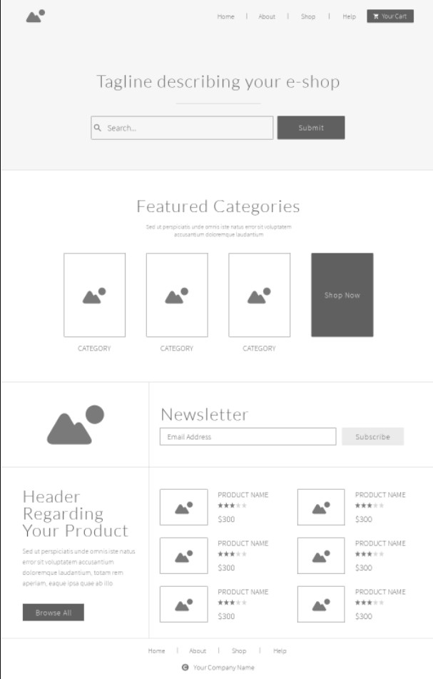
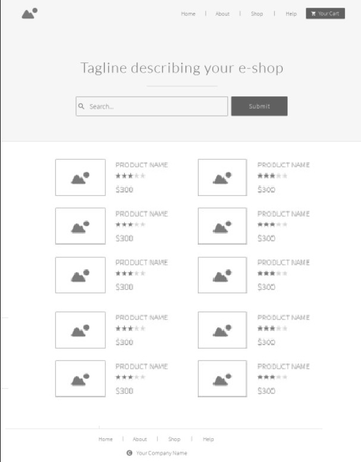

# E-Commerce-Website

A website that allows people to buy and sell physical goods, services, and digital products over the internet rather than at a brick-and-mortar location. Through an e-commerce website, a business can process orders, accept payments, manage shipping and logistics, and provide customer service.

## User Stories and Tasks

- As an admin user, I would like to have a dashboard where I can see a list of product categories
- As an admin user, I would like to view a detail page for each category so that I can eventually edit its data or delete it
- As an admin user, I would like to see a list of the products assigned to a category on the category details page
- As an admin user, I would like a detail page for each product so that I can eventually edit its data or delete it

## Home Page

---

 

## Products Page

---

 

## Product Details Page

---

 

## Cart Page

---

 

